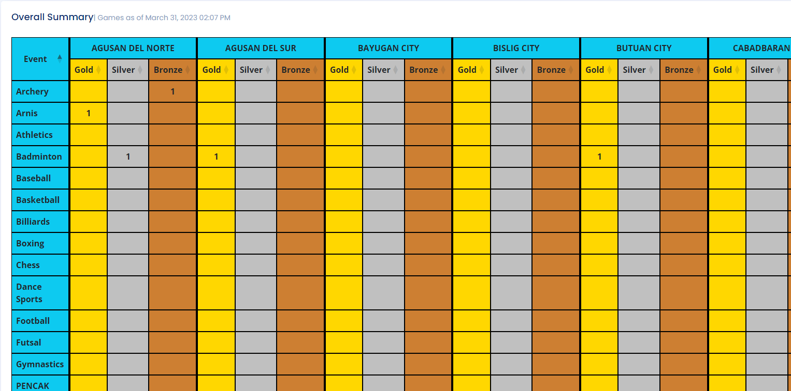

Send Suggestions to: nerison.pitogo@deped.gov.ph

Sports
This application does not use migrations, so instead of running database migrations, you will need to upload the SQL file provided.

The application has three types of users: Admin, Encoder, and Validator. Only validated scores will be included in the overall summary.

